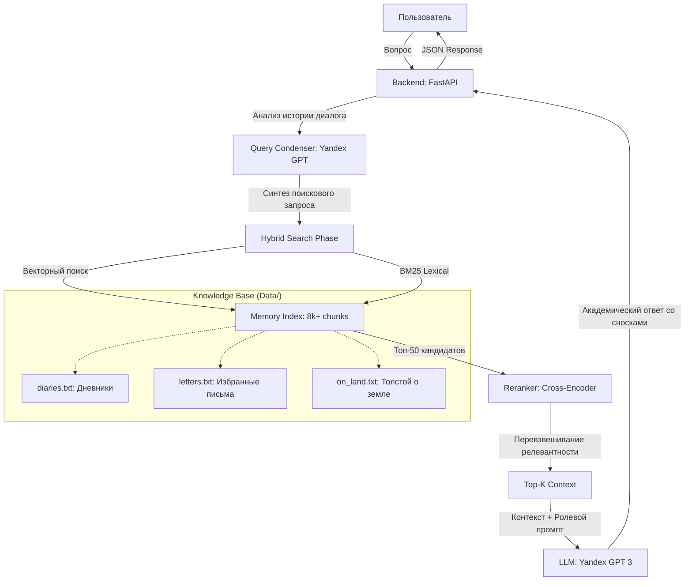

# Цифровой Аватар Льва Толстого (Talk to Tolstoy) 🏛️🏮🧔

Интерактивный цифровой аватар графа Льва Николаевича Толстого, способный вести философские беседы на основе его личных дневников, писем и философских трактатов. Проект сочетает в себе современные технологии генеративного ИИ и многослойную поисковую систему (Advanced RAG) для воссоздания личности великого мыслителя.

---

## 🏛️ Архитектура системы (Multi-Stage RAG)

Проект использует продвинутую систему извлечения знаний, состоящую из двух фаз поиска и интеллектуального реранжирования, что обеспечивает высочайшую точность и минимизирует галлюцинации.

---

## 🛠️ Технологический стек проекта

| Компонент | Технология | Описание |
| :--- | :--- | :--- |
| **Backend** | Python 3.10+, FastAPI | Высокопроизводительная серверная часть на Windows (UTF-8). |
| **Frontend** | React 19, Vite, CSS | Премиальный «бумажный» интерфейс с поддержкой сносок. |
| **LLM / AI** | Yandex GPT v3 | Генерация ответов, ролевая логика и конденсация запросов. |
| **Reranker** | Cross-Encoder (MiniLM) | Реранжирование кандидатов для повышения точности (LLM-rerank). |
| **Embeddings** | Yandex GPT ML | Векторизация 77МБ знаний для семантического поиска. |
| **Search Engine** | Hybrid (Vector + BM25) | Комбинированный поиск по смыслу и точным цитатам. |
| **Memory** | Rolling Window | Хранение истории последних 10 сообщений для контекстной памяти. |

---

## ⭐ Техническая сложность (Senior Content)

Проект выходит за рамки классического RAG благодаря реализации следующих enterprise-решений:

1. **Two-Phase Retrieval & Reranker**: Система не просто ищет похожие куски текста, а производит глубокое реранжирование топ-50 кандидатов через модель Cross-Encoder, что критически важно для философских текстов.
2. **Contextual Query Synthesis**: Использование LLM для переписывания (condensing) каждого нового вопроса с учетом истории переписки. Это позволяет Аватару понимать уточняющие вопросы («Кто это?», «Почему он так считал?»).
3. **Source-Aware Memory (Nuclear Filter)**: Внедрена классификация данных из папки **Data** (diaries.txt, letters.txt, on_land.txt), позволяющая системе отказываться от ответов на личные вопросы, если в памяти есть только философские труды.
4. **Academic Citations**: Автоматическая генерация надстрочных сносок (Unicode superscripts) и раздела источников, распознаваемого фронтендом.
5. **Safe Indexing (Rate Limit Handling)**: Система индексации 8000+ чанков спроектирована с учетом жестких лимитов Yandex Cloud (Exponential Backoff).

---

## 🚀 Как запустить

1. Установите зависимости в `frontend` и `backend`.
2. Настройте `.env` с ключами Yandex Cloud.
3. Запустите индексатор: `python scripts/rebuild_index_safe_persist.py`.
4. Запустите сервер: `python backend/server.py`.
