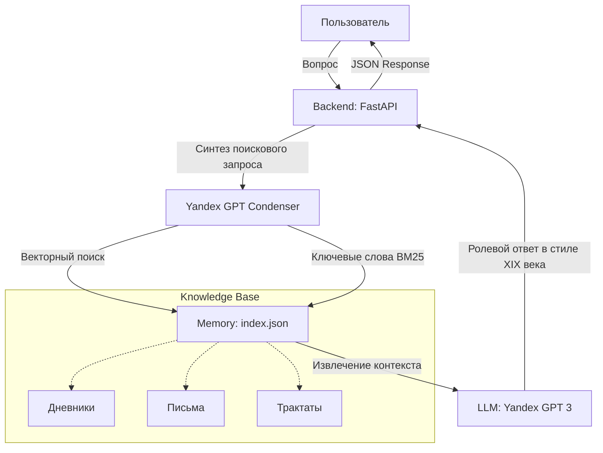

# Цифровой Аватар Льва Толстого (Talk to Tolstoy) 🏛️🏮🧔

Интерактивный цифровой аватар графа Льва Николаевича Толстого, способный вести философские беседы на основе его личных дневников, писем и философских трактатов. Проект сочетает в себе современные технологии генеративного ИИ и глубокую поисковую систему (RAG) для воссоздания личности великого мыслителя.

---

## 🏛️ Архитектура RAG (Source-Aware Memory)

Проект использует гибридную систему поиска (Semantic + Lexical), чтобы обеспечить историческую точность ответов.

---

## 🛠️ Технологический стек проекта

| Компонент | Технология | Описание |
| :--- | :--- | :--- |
| **Backend** | Python 3.10+, FastAPI | Высокопроизводительный серверный интерфейс. |
| **Frontend** | React 19, Vite, Tailwind | Современный, отзывчивый и «премиальный» интерфейс. |
| **LLM / AI** | Yandex GPT v3 | Генерация ответов и ролевая логика. |
| **Embeddings** | Yandex GPT ML | Векторизация знаний для быстрого поиска. |
| **Search Engine** | BM25 (Hybrid RAG) | Бустинг ключевых слов для поиска по специфическим цитатам. |

---

## ⭐ Сложность проекта

**Уровень сложности: 4 звезды (Senior)** ⭐⭐⭐⭐

### Почему так?
1. **Source-Aware Filtering**: Реализована система «Ядерного фильтра», которая изолирует личные воспоминания (дневники) от философских рассуждений (трактаты) для предотвращения галлюцинаций в биографических вопросах.
2. **Rate Limit Handling**: Глубокая оптимизация индексации под строгие квоты Yandex GPT API (линейная обработка с экспоненциальной задержкой).
3. **Encoding Stability**: Решена проблема работы с кириллицей (CP1251) в многослойных RAG-системах на Windows.

---

## 🚀 Как запустить

1. Установите зависимости в `frontend` и `backend`.
2. Настройте `.env` с ключами Yandex Cloud.
3. Запустите индексатор: `python scripts/rebuild_index_safe_persist.py`.
4. Запустите сервер: `python backend/server.py`.
